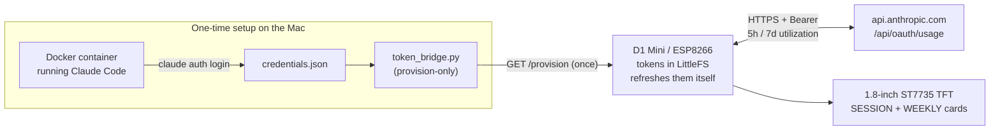
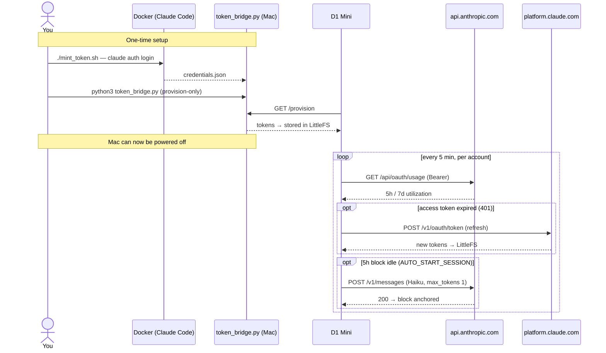
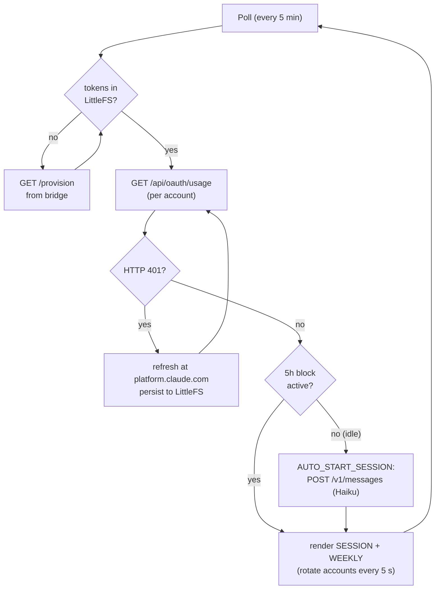
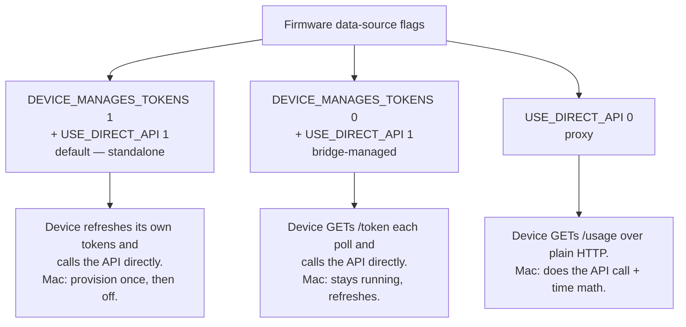
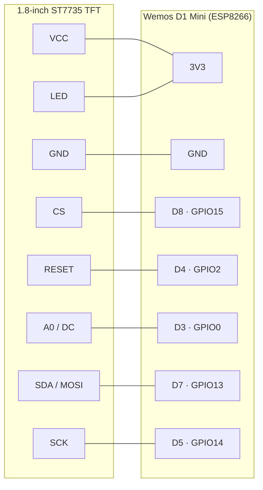

# Claude Usage Monitor (ESP8266 + ST7735)

A little desk gadget that shows your **Claude session (5-hour block)** and
**weekly (7-day)** usage on a 1.8" TFT — the *real* plan limit %s, the same ones
Claude Code's `/usage` shows.



**How the real %s are obtained:** Claude Code authenticates with OAuth, and its
own usage endpoint, `api.anthropic.com/api/oauth/usage`, returns the live 5h/7d
utilization. We log into Claude Code inside a throwaway Linux **Docker**
container, copy out its OAuth credential bundle, and use that token — no browser,
no Cloudflare, no scraping. (The old browser-scrape approach lives on in
`bridge.py` / `CLOUDFLARE_NOTES.md`; this token approach replaces it.)

**Default = standalone device** (`DEVICE_MANAGES_TOKENS 1`): the ESP8266 pulls the
credential bundle from the bridge's `/provision` **once** (into flash), then calls
the usage API directly *and* refreshes its own OAuth tokens — so after setup the
Mac isn't needed at all. Because refresh tokens are single-use and rotate, only
one party may refresh an account, so you run the bridge in `PROVISION_ONLY` mode
for the hand-off (it never refreshes), then shut it off. Prefer the Mac to keep
ownership of refresh instead? Set `DEVICE_MANAGES_TOKENS 0` and the device fetches
a fresh bearer from `/token` each poll (bridge stays running). See `OAUTH_NOTES.md`.

## How it works

**Lifecycle** — the Mac is only needed once, to hand the device its tokens:



**What the device does each poll:**



**Modes** (compile-time flags in the firmware — see step 3):



## Hardware

Two parts and eight jumper wires — **no soldering** needed if you use a breadboard
or female-to-female jumpers. Everything runs at 3.3 V off the D1 Mini's onboard
regulator and is powered over USB, so there's no separate power supply.

### Bill of materials

| Part | What it is | Notes |
|---|---|---|
| **Wemos / LOLIN D1 Mini** (ESP8266) | brains + WiFi | Any ESP8266 "D1 Mini" clone works. ~$3–5 |
| **1.8-inch ST7735 TFT**, 128×160, SPI | the display | Get the **SPI ST7735** variant with the 8-pin header (`VCC GND CS RESET A0/DC SDA SCK LED`). ~$4–7 |
| **8 × female–female jumper wires** | board ↔ display | |
| **Micro-USB cable** | power + flashing | |
| *(optional)* breadboard / small case | mounting | |

### Wiring (TFT → D1 Mini)



| TFT pin    | D1 Mini      | Note                |
|------------|--------------|---------------------|
| VCC        | 3V3          | onboard regulator   |
| GND        | GND          |                     |
| CS         | D8 (GPIO15)  | chip select         |
| RESET      | D4 (GPIO2)   |                     |
| A0 / DC    | D3 (GPIO0)   | data/command        |
| SDA / MOSI | D7 (GPIO13)  | hardware SPI MOSI   |
| SCK        | D5 (GPIO14)  | hardware SPI clock  |
| LED        | 3V3          | backlight           |

> **Pin labels vary by board:** `SCL = SCK`, `SDA = MOSI`, `DC = A0 = RS`,
> `RES = RESET`, `BLK = LED`. SDA/MOSI (D7) and SCK (D5) are the ESP8266's fixed
> hardware-SPI pins — don't remap them. If colours or the image offset look wrong
> after flashing, switch `TFT_INITTAB` to `INITR_GREENTAB` / `INITR_REDTAB`.

## 1. Mint an OAuth token (one time)

You need [Docker Desktop](https://www.docker.com/products/docker-desktop/)
running. Then:

```bash
cd "claude code display"
./mint_token.sh
```

This builds a small Linux image with Claude Code and runs `claude auth login` so
you can **log in once**: it prints an authorize URL — open it, approve, and
claude.com shows a code you paste back into the terminal (a paste-the-code flow,
so it works inside Docker with no port mapping). It then writes the credentials,
exits, and the script copies the container's `~/.claude/.credentials.json` to
`~/.claude_usage_bridge/credentials.json` and deletes the container. Re-run it
only if the token ever gets revoked.

> Why Docker? On Linux, Claude Code stores its OAuth bundle as a plain JSON file
> (unlike the macOS Keychain), so it's trivial to copy out. The container exists
> purely to produce that file.

**Multiple accounts.** Give each account a name and the device rotates through
them (the firmware already supports this):

```bash
./mint_token.sh Work           # -> credentials-work.json, shows "Work"
./mint_token.sh Personal       # -> credentials-personal.json, shows "Personal"
./mint_token.sh                # prompts for a name (Enter to skip -> shows email)
```

`token_bridge.py` auto-discovers every `~/.claude_usage_bridge/credentials*.json`,
refreshes each, and serves them all. **The device shows the name you minted with**
(stored in the credential file, original casing kept). Precedence:
`ACCOUNT_LABELS="Personal,Work"` env override → the minted name → the filename
slug → the account email. So name your accounts and the display stays short and
readable instead of showing long emails.

## 2. Run the token bridge on your Mac

**Standalone device (default).** The bridge now defaults to **provision-only** —
it serves `/provision` but never refreshes, so it can't fight the device over the
(single-use, rotating) refresh token:

```bash
python3 token_bridge.py        # provision-only by default; no pip installs
```

Run it just long enough for the device to boot and provision (step 3), then you
can stop it — the device is self-sufficient. Re-run only to re-provision after a
`./mint_token.sh` re-mint.

**Bridge-managed mode** (`DEVICE_MANAGES_TOKENS 0`): make the bridge the refresher
that serves `/token` + `/usage` by turning provision-only off:

```bash
PROVISION_ONLY=0 python3 token_bridge.py     # bridge owns refresh; keep it running
```

Either way, open the debug page (`http://192.168.1.4:8088/`) to confirm your live
5h/7d %s. macOS may ask to allow incoming connections — allow it.

Env vars: `PORT` (8088), `POLL_SECONDS` (60), `REFRESH_SKEW_SEC` (300),
`ACCOUNT_LABELS`, `CRED_DIR`, `PROVISION_ONLY` (default `1`). The plan limit %s
come straight from the API, so there are no budgets to tune anymore.

## 3. Flash the firmware

Open `claude_monitor/claude_monitor.ino` in the Arduino IDE.

**Install libraries** (Library Manager): *Adafruit GFX*, *Adafruit ST7735 and
ST7789*, *ArduinoJson* (v7).

**Edit the USER CONFIG block:**
- `WIFI_SSID` / `WIFI_PASS`
- `DEVICE_MANAGES_TOKENS` — `1` (default): **standalone**. The device provisions
  from `PROVISION_URL` once into LittleFS, then refreshes its own tokens — no Mac
  needed after setup (run the bridge with `PROVISION_ONLY=1` for the hand-off).
  `0`: the device fetches a bearer from `TOKEN_URL` each poll and the Mac owns
  refresh (bridge stays running). Requires `USE_DIRECT_API 1`.
- `USE_DIRECT_API` — `1` (default): device calls `api.anthropic.com` itself.
  `0`: **proxy** — device just polls `SERVER_URL` (`/usage`) and the bridge does
  the API call + time math (lightest on the device; no device TLS).
- `PROVISION_URL` / `TOKEN_URL` / `SERVER_URL` → point all at the Mac:port
  `token_bridge.py` prints (`/provision`, `/token`, `/usage` respectively).
- Direct/standalone modes do NTP (`pool.ntp.org`) to turn the API's absolute reset
  times into countdowns, and use ~16 KB of heap for TLS — fine on a D1 Mini, but
  if you hit out-of-memory resets, fall back to `USE_DIRECT_API 0`.
- **First boot (standalone):** the device shows "Waiting for API..." until it can
  reach `/provision` once; after that it runs from flash even with the Mac off.
- `AUTO_START_SESSION` — `1` (default): when an account has no active 5h block,
  the device sends one minimal Haiku message (as Claude Code) to anchor the block,
  once per idle period. Costs ~22 tokens (rounds to 0% usage). Set to `0` to
  disable. Requires `DEVICE_MANAGES_TOKENS 1`.
- If colors/offsets look wrong, switch `TFT_INITTAB` to `INITR_GREENTAB` or `INITR_REDTAB`.
- The sketch runs SPI at 40 MHz for a smooth boot animation. If the display shows
  noise/garbage, lower `tft.setSPISpeed(40000000)` to `24000000`.
- The boot spark is double-buffered (drawn to a RAM sprite, then blitted) so it
  doesn't flicker. If that spark renders in the wrong color (e.g. blue instead of
  orange), your Adafruit_GFX build wants the buffer byte-swapped — swap the bytes
  in `COL_CLAUDE`/`COL_TEXT` for the sprite, or ask and I'll add a swap flag.

**Board:** `LOLIN(WEMOS) D1 R2 & mini` · Upload Speed `921600` (drop to `115200`
if uploads fail). Wire the display per the [Hardware](#hardware) section first.

**Flash Size:** pick a layout that allocates a filesystem, e.g.
**Tools → Flash Size → `4MB (FS:2MB ...)`**. Standalone mode stores its tokens in
LittleFS; with `FS:none` there's nowhere to persist them and the device would
re-provision on every boot (needing the bridge each time).

## 4. What you'll see

**Boot:** a big animated Claude "spark" (the orange sunburst) breathes and slowly
rotates over a "Claude" wordmark while it connects to WiFi and fetches the first
reading.

**Dashboard:** two "instrument cards" — each leads with a big color-coded
percentage (the hero), a size-2 reset countdown with a clock glyph, and a
segmented meter. The header shows the **account name** (plus an `n/N` page
indicator when you've minted more than one account).

```
┌──────────────────────────┐
│ Personal           1/2 ✦ │   ✦ = animated spark + status light
│ ───────────────────────  │   (orange = OK, red = stale)
│ SESSION  5h      RESETS  │   1/2 = which account (rotates every 5s)
│  38%           ◷ 4h24m   │   big % is green/yellow/red by usage
│ ▓▓▓▓░|░░░░|░░░░|░░░░|░░░  │   segmented meter
│ ───────────────────────  │
│ WEEKLY  7d       RESETS  │
│  62%           ◷ 4d 15h  │
│ ▓▓▓▓▓▓▓▓▓▓▓▓░|░░░|░░░|░░  │
└──────────────────────────┘
```

The hero %, meter fill and border go green < 60%, yellow 60–85%, red ≥ 85% (a
warning triangle blinks when maxed). Idle sessions show "IDLE" (unless
`AUTO_START_SESSION` re-anchors the block first); a stale feed dims the values and
turns the header rule + spark red. The spark animates continuously (non-blocking).
**Usage data refreshes every 5 min** (gentle on the API rate limit), and with
multiple accounts the display **rotates every 5s**. If a panel variant shows wrong
colors, switch `TFT_INITTAB`. To iterate on this layout, see [design-package/](design-package/).

## Keeping the bridge running

- **Standalone mode (default):** you do **not** need the bridge running. After the
  device provisions once, it runs entirely from flash — power the Mac off. Only
  start the bridge again to re-provision after a `./mint_token.sh` re-mint.
- **Bridge-managed mode (`DEVICE_MANAGES_TOKENS 0`):** the bridge must stay up
  (`PROVISION_ONLY=0 python3 token_bridge.py`). To auto-start it at login, wrap it
  in a `launchd` plist (`~/Library/LaunchAgents/...`) — ask and I'll generate one.

## Endpoints (`token_bridge.py`)

`GET /usage` — device-ready JSON; powers the debug page and the proxy path
(`USE_DIRECT_API 0`). Per-account `pct` / `resets_in_min` for `session` (5h) and
`weekly` (7d), plus an `accounts[]` array the device rotates through:

```json
{
  "ok": true, "ts": 1781388336, "account": "Personal",
  "session": { "pct": 0,  "resets_in_min": 0,    "active": true },
  "weekly":  { "pct": 29, "resets_in_min": 6174, "days": 7 },
  "accounts": [
    { "account": "Personal", "idx": 1, "active": true,  "session": { } , "weekly": { } },
    { "account": "Work",     "idx": 2, "active": false, "session": { } , "weekly": { } }
  ]
}
```

> The `pct`/`resets_in_min` come straight from the API's real utilization. (Legacy
> `cost`/`tokens`/`budget` fields still appear but are zero and unused.)

- `GET /token` → `{ "beta", "usage_url", "accounts": [ { "label", "token", "expires_at" } ] }` — fresh bearers for `DEVICE_MANAGES_TOKENS 0`.
- `GET /provision` → adds `"refresh_token"` + `"client_id"` + `"token_url"` per account — the one-time hand-off for standalone mode.
- `GET /` debug page · `GET /refresh` force a refresh (bridge-managed) · `GET /usage_raw` raw API response.
